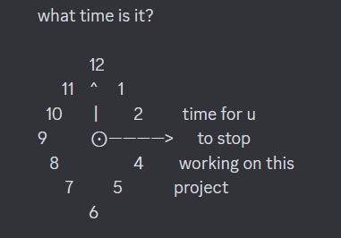

# Instructions d'Installation du Projet

Ce README décrit les étapes pour installer et démarrer le projet après avoir effectué un `git clone`.


## Étape 1 : Installation des Dépendances

Après avoir cloné le dépôt, ouvrez un terminal et exécutez les commandes suivantes à la racine du projet :

```bash
npm run install
```

( cette commande va installer les dépendances nécessaire au projet)

## Étape 2 : Lancement du Projet

Pour démarrer le projet, utilisez la commande suivante, toujours à la racine :

```bash
npm run start
```
Cette commande lance la front et la back.

# Explication du projet 

SketchDraw est une petite application faite en react vite / Fabricjs et chakra-UI.

Il est possible de créer alors des petits carnets de dessin avec plusieurs pages via la manipulation d'un canvas dans un espace éditeur inspiré par les outils google.


L'application utilise un json et une API local pour stocker les données via le package json server.

Précision  : Il est possible de zoomer/dézoomer en utilisant la molette et déplacer le dessin en maintenant ALT + click.

(Je ne travaille plus sur ce projet il ne m'intéresse plus)




